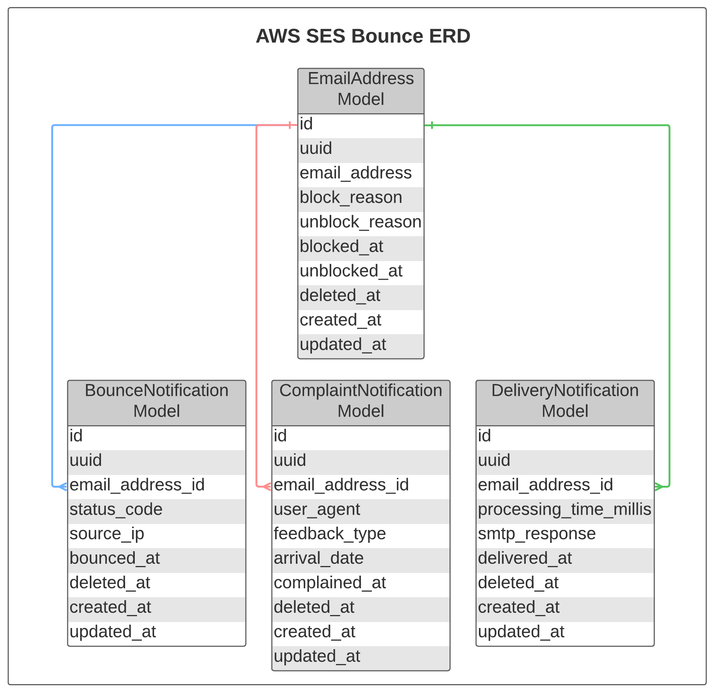
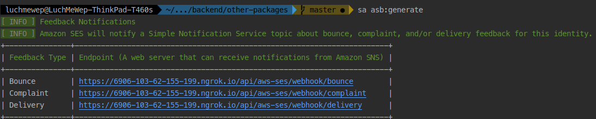
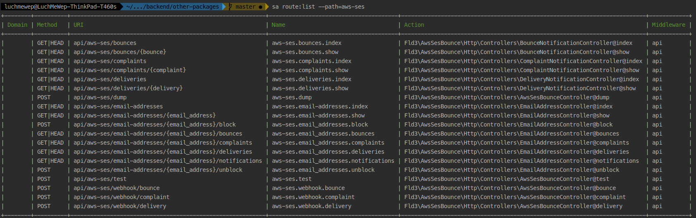
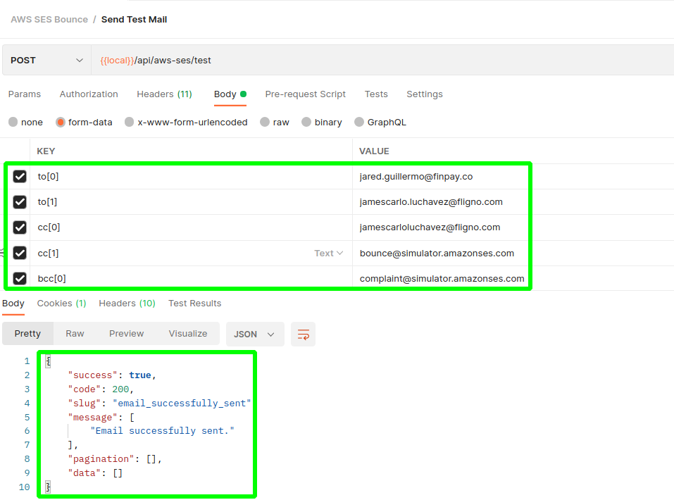

# AWS SES Bounce for Laravel 8|9|10

[![Latest Version on Packagist][ico-version]][link-packagist]
[![Total Downloads][ico-downloads]][link-downloads]
[![GitHub Repo stars][ico-stars]][link-stars]
[![Discord][ico-discord]][link-discord]
[![Twitter Follow][ico-twitter]][link-twitter]

Using AWS Simple Email Service (SES) for sending emails and newsletters is very common in Laravel apps nowadays.
AWS SES [configurations](https://laravel.com/docs/8.x/mail#ses-driver) for Laravel is easy to follow as well.

The problem now is the maintenance part of sending these emails.
Sending emails to unverified addresses can cause `bounces` whereas sending too many emails can cause `complaints`.
If these `bounces` and `complaints` are left unchecked, it may cause the reputation of the sender to be damaged.

According to this [documentation](https://docs.aws.amazon.com/ses/latest/dg/monitor-sender-reputation.html),
if the bounce or complaint rates are too high, AWS might place the account under review or pause the account's ability to send email.

The aim of this package, `luchavez/aws-ses-bounce`, is to monitor the email `bounces`, `complaints`, and `successful deliveries`.
This package records the recipient email addresses and their `bounces`, `complaints`, and `deliveries`.

One cool feature of this package is the `automatic blocking`.
When a set amount of `bounces` or `complaints` is reached, the email address causing that will be immediately blocked.
Another cool feature would be the automatic removal of blocked email address from `to`, `cc`, and `bcc` recipients during email sending. 

Here's the entity relationship diagram (ERD) of this package:



Want to contribute? Visit [contributing.md](contributing.md) to see a todo list.

## Installation

Via Composer

``` bash
$ composer require luchavez/aws-ses-bounce:^1.0.0
```

## Setting Up

1. Run `php artisan migrate` to create the tables.

2. Add these variables to `.env` file if you want to override the default values of the package's [config](./config/aws-ses-bounce.php).

| Variable Name                    | Default Value       | Description                                                                 |
|----------------------------------|---------------------|-----------------------------------------------------------------------------|
| `ASB_API_MIDDLEWARE`             | `[]`                | This will be used by all API routes within the package except the webhooks. |
| `ASB_EMAIL_TEST_API_ENABLED`     | `true`              | This route is used for sending test emails.                                 |
| `ASB_DUMP_URL`                   | `config('app.url')` | This route will be used for dumping data. Useful for debugging.             |
| `ASB_DUMP_ENABLED`               | `false`             | Decides whether the dump data route will be accessible or not.              |
| `ASB_VALIDATE_SIGNATURE`         | `false`             | Decides whether to enforce signed routes.                                   |
| `ASB_MAX_BOUNCE_COUNT`           | `3`                 | Maximum bounce count an email can get before being blocked.                 |
| `ASB_SOFT_DELETE_NOTIFICATIONS`  | `false`             | Decides whether to soft-delete SES Feedback Notifications.                  |
| `ASB_DELIVERIES_MAX_AGE_IN_DAYS` | `7`                 | Maximum age in days of Delivery Notification.                               |
## Usage

### AWS SES Bounce Service

The package provides a service called [**AwsSesBounce**](src/Services/AwsSesBounce.php) which you can use by calling its [helper functions](helpers/aws-ses-bounce-helper.php):
1. `awsSesBounce()`
2. `aws_ses_bounce()`

Here's the list of its available methods.

| Method Name                           | Return Type  | Description                                                |
|---------------------------------------|--------------|------------------------------------------------------------|
| `getBlockedEmails`                    | `Collection` | gets the list of blocked emails from cache                 |
| `getApiMiddleware`                    | `array`      | gets the middleware for other API routes                   |
| `filterBouncedEmails`                 | `array`      | separates rejected email address from accepted ones        |
| `isEmailTestApiEnabled`               | `bool`       | checks if send test email API is enabled                   |
| `sendTestEmail`                       | `void`       | sends test email to `to`, `cc`, and `bcc` recipients       |
| `getMaxBounceCount`                   | `int`        | gets maximum bounce count before automatic block           |
| `block`                               | `void`       | blocks an email address manually                           |
| `unblock`                             | `void`       | unblocks an email address manually                         |
| `getBounceReasons`                    | `Collection` | gets list of possible bounce reasons                       |
| `shouldSoftDeleteNotifications`       | `bool`       | check whether to soft-delete or force-delete notifications |
| `getDeliveryNotificationMaxAgeInDays` | `int`        | get maximum age in days for delivery notifications         |

### GenerateAwsSesBounceSignedURLCommand Artisan Command

To be able to receive AWS SES feedbacks via AWS SNS Topics, you must generate first the endpoints by running:

```
php artisan asb:generate
```

You'll be getting something like this:



Submit these endpoints to assigned DevOps personnel so they can set it up on AWS Console.

### Routes



**Note**: If `APP_ENV` is equal to `production`, `api/aws-ses/test` and `api/aws-ses/dump` routes will be disabled. 

## Resources

- [Amazon SNS notification examples for Amazon SES](https://docs.aws.amazon.com/ses/latest/dg/notification-examples.html)
- [Bounce object](https://docs.aws.amazon.com/ses/latest/dg/notification-contents.html#bounce-object)
- [Complaint object](https://docs.aws.amazon.com/ses/latest/dg/notification-contents.html#complaint-object)
- [Delivery object](https://docs.aws.amazon.com/ses/latest/dg/notification-contents.html#delivery-object)

## Change log

Please see the [changelog](changelog.md) for more information on what has changed recently.

## Testing

To send test emails, you can use the `/api/aws-ses/test` route. Add `to`, `cc`, and `bcc` recipients - can be array or just a single value.



## Contributing

Please see [contributing.md](contributing.md) for details and a todolist.

## Security

If you discover any security related issues, please email jamescarloluchavez@gmail.com instead of using the issue tracker.

## Credits

- [James Carlo Luchavez][link-author]
- [All Contributors][link-contributors]

## License

Please see the [license file](license.md) for more information.

[ico-version]: https://img.shields.io/packagist/v/luchavez/aws-ses-bounce.svg
[ico-downloads]: https://img.shields.io/packagist/dt/luchavez/aws-ses-bounce.svg
[ico-stars]: https://img.shields.io/github/stars/luchavez-technologies/aws-ses-bounce
[ico-discord]: https://img.shields.io/discord/1143744619956404295?color=8c9eff&label=Discord&logo=discord
[ico-twitter]: https://img.shields.io/twitter/follow/luchaveztech

[link-packagist]: https://packagist.org/packages/luchavez/aws-ses-bounce
[link-downloads]: https://packagist.org/packages/luchavez/aws-ses-bounce
[link-stars]: https://github.com/luchavez-technologies/aws-ses-bounce
[link-discord]: https://discord.gg/bFpDTgp3
[link-twitter]: https://twitter.com/luchaveztech

[link-author]: https://github.com/luchavez-technologies
[link-contributors]: ../../contributors
